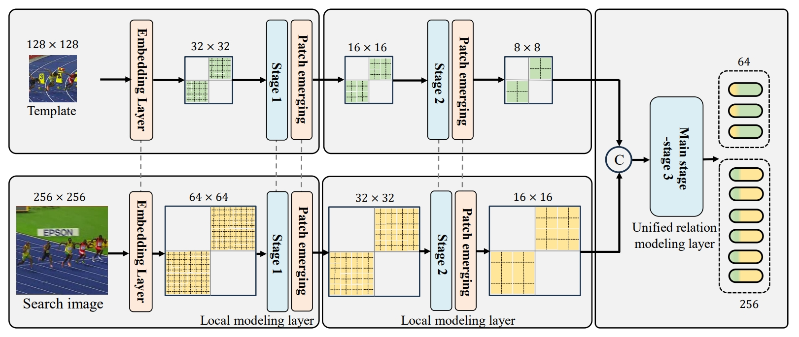
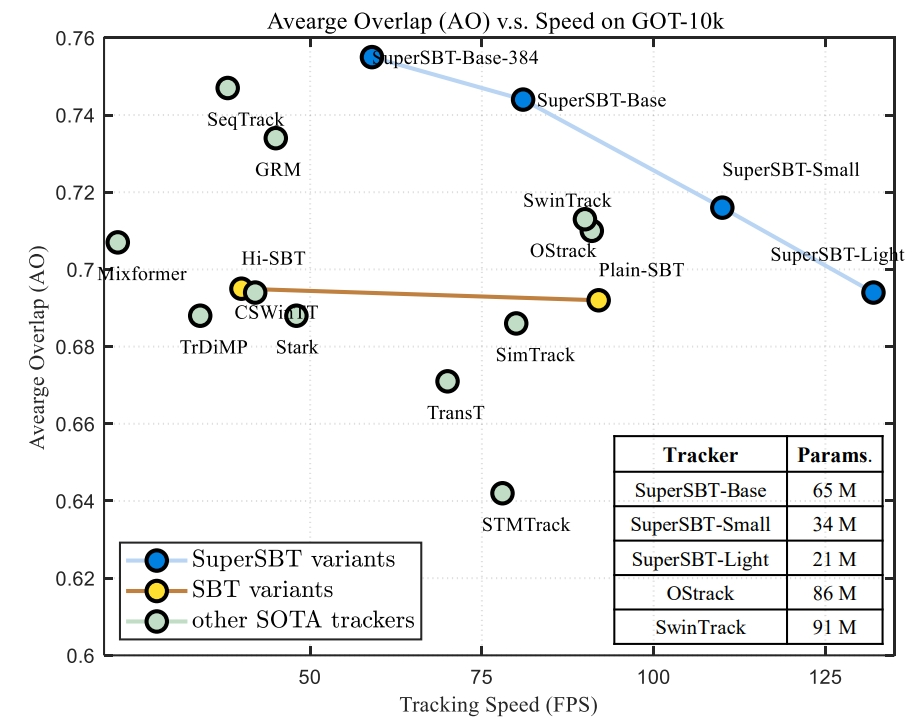

# OSTrack
The official implementation for the SuperSBT, [Correlation-Embedded Transformer Tracking:
A Single-Branch Framework](https://arxiv.org/pdf/2401.12743).

The conference version, SBT is the **CVPR 2022** paper [Correlation-Aware Deep Tracking
](https://openaccess.thecvf.com/content/CVPR2022/papers/Xie_Correlation-Aware_Deep_Tracking_CVPR_2022_paper.pdf) and

[[Models](httpshSy?usp=sharing)] [[Raw Results](https://drCiaR?usp=sharing)]


## Highlights

### Improved One-stream Tracking Framework
<p align="center">
  
</p>

SuperSBT adopts a hierarchical architecture with a local modeling layer to enhance shallow-level features. A unified relation modeling is proposed to remove complex handcrafted layer pattern
designs. SuperSBT is further improved by masked image modeling pre-training, integrating temporal modeling, and equipping with
dedicated prediction heads. 

### Better Speed-performance Trade-off
<p align="center">
  
</p>

|    Tracker     | GOT-10K (AO) | LaSOT (AUC) | TrackingNet (AUC) | TNL2K(AUC) |
|:--------------:|:------------:|:-----------:|:-----------------:|:----------:|
| SuperSBT-Base  |     74.4     |    70.0     |       84.0        |    56.6    |
| SuperSBT-Small |     71.6     |    67.5     |       82.7        |    55.7    |
| SuperSBT-Light |     69.4     |    65.8     |       81.4        |    53.6    |


## Install the environment
**Option1**: Use the Anaconda (CUDA 10.2)
```
conda create -n supersbt python=3.8
conda activate supersbt
bash install.sh
```

**Option2**: Use the Anaconda (CUDA 11.3)
```
conda env create -f supersbt_cuda113_env.yaml
```

**Option3**: Use the docker file

We provide the full docker file here.


## Set project paths
Run the following command to set paths for this project
```
python tracking/create_default_local_file.py --workspace_dir . --data_dir ./data --save_dir ./output
```
After running this command, you can also modify paths by editing these two files
```
lib/train/admin/local.py  # paths about training
lib/test/evaluation/local.py  # paths about testing
```

## Data Preparation
Put the tracking datasets in ./data. It should look like:
   ```
   ${PROJECT_ROOT}
    -- data
        -- lasot
            |-- airplane
            |-- basketball
            |-- bear
            ...
        -- got10k
            |-- test
            |-- train
            |-- val
        -- coco
            |-- annotations
            |-- images
        -- trackingnet
            |-- TRAIN_0
            |-- TRAIN_1
            ...
            |-- TRAIN_11
            |-- TEST
   ```


## Training
Download pre-trained MAE weight and put it under `$PROJECT_ROOT$/pretrained_models` 
```
python tracking/train.py --script supersbt --config supersbt_base --save_dir ./output --mode multiple --nproc_per_node 4 --use_wandb 0
python -m torch.distributed.launch --nproc_per_node 8 lib/train/run_training.py --script supersbt --config supersbt_base --save_dir .

```

Replace `--config` with the desired model config under `experiments/supersbt`. We use [wandb](https://github.com/wandb/client) to record detailed training logs, in case you don't want to use wandb, set `--use_wandb 0`.


## Evaluation
Download the model weights from [Google Drive]() 

Put the downloaded weights on `$PROJECT_ROOT$/output/checkpoints/train/supersbt`

Change the corresponding values of `lib/test/evaluation/local.py` to the actual benchmark saving paths

Some testing examples:
- LaSOT or other off-line evaluated benchmarks (modify `--dataset` correspondingly)
```
python tracking/test.py supersbt supersbt_base --dataset lasot --threads 16 --num_gpus 4
python tracking/analysis_results.py # need to modify tracker configs and names
```
- GOT10K-test
```
python tracking/test.py supersbt supersbt_base_got --dataset got10k_test --threads 16 --num_gpus 4
python lib/test/utils/transform_got10k.py --tracker_name supersbt --cfg_name supersbt_base_got
```
- TrackingNet
```
python tracking/test.py supersbt supersbt_base --dataset trackingnet --threads 16 --num_gpus 4
python lib/test/utils/transform_trackingnet.py --tracker_name supersbt --cfg_name supersbt_base
```


## Test FLOPs, and Speed
*Note:* The speeds reported in our paper were tested on a single RTX2080Ti GPU.

```
# Profiling supersbt_base
python tracking/profile_model.py --script supersbt --config supersbt_base
# Profiling vitb_384_mae_ce_32x4_ep300
python tracking/profile_model.py --script supersbt --config supersbt_base
```


## Acknowledgments
* Thanks for the [STARK](https://github.com/researchmm/Stark), [OStrack](https://github.com/botaoye/OSTrack), and [PyTracking](https://github.com/visionml/pytracking) library, which helps us to quickly implement our ideas.
* We use the implementation of the [HiViT](https://github.com/zhangxiaosong18/hivit).  


## Citation
If our work is useful for your research, please consider citing:

```Bibtex
@article{xie_2024_SuperSBT,
  title={Correlation-Embedded Transformer Tracking: A Single-Branch Framework},
  author={Xie, Fei and Yang, Wankou and Wang, Chunyu and Chu, Lei and Cao, Yue and Ma, Chao and Zeng, Wenjun},
  journal={arXiv preprint arXiv:2401.12743},
  year={2024}
}

@InProceedings{xie_2022_SBT,
    author    = {Xie, Fei and Wang, Chunyu and Wang, Guangting and Cao, Yue and Yang, Wankou and Zeng, Wenjun},
    title     = {Correlation-Aware Deep Tracking},
    booktitle = {Proceedings of the IEEE/CVF Conference on Computer Vision and Pattern Recognition (CVPR)},
    year      = {2022},
}

```
